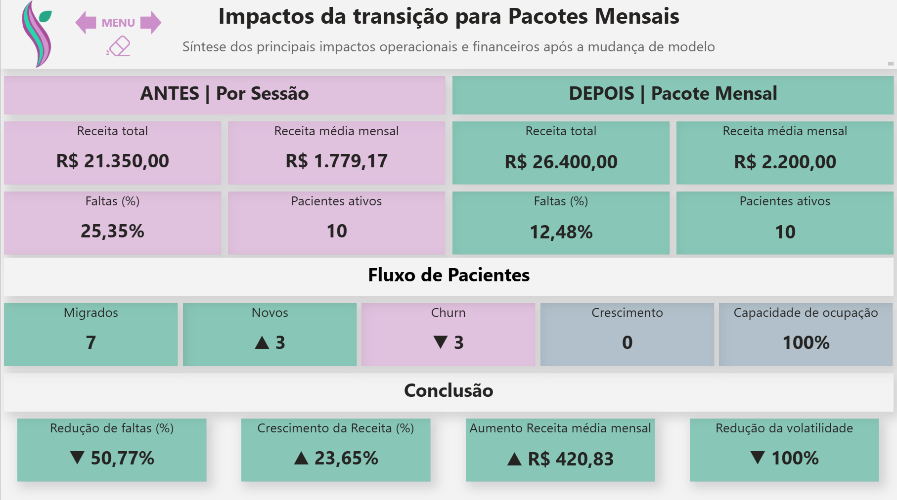

# End-to-End Data Pipeline: Da Assiduidade à Previsibilidade Financeira em Consultório de Terapia Ocupacional Pediátrica

Este pipeline foi desenvolvido para estruturar e analisar dados operacionais de um consultório, com o objetivo de mensurar o impacto do absenteísmo na previsibilidade financeira e na continuidade do tratamento.  
<br>
<p align="center">
  
  
  
  
  
  
  
  
  
</p>  

>[!NOTE] 
>Esse projeto foi desenvolvido a partir de dados reais de um consultório de Terapia Ocupacional Pediátrica.  
>Por questões de segurança e privacidade, todos os dados foram **anonimizados**.

## Sumário
1. [Destaques do Projeto (TL;DR)](#destaques-do-projeto-tldr)  
2. [Problema de Negócio](#problema-de-negócio)  
3. [Objetivo do Projeto](#objetivo-do-projeto)  
4. [Estratégia da Solução](#estratégia-da-solução)  
5. [Tecnologias Utilizadas](#tecnologias-utilizadas)  
6. [Visão Geral do Pipeline](#visão-geral-do-pipeline)  
7. [Arquitetura e Modelagem](#arquitetura-e-modelagem)  
8. [Como Executar o Pipeline](#como-executar-o-pipeline)  
9. [Logs de Execução](#logs-de-execução)  
10. [Principais Insights](#principais-insights)  
11. [Resultados](#resultados)  
12. [Dashboard do Projeto](#dashboard-do-projeto)  
13. [Conclusão](#conclusão)  
14. [Próximos Passos](#próximos-passos)  

## Destaques do Projeto (TL;DR)

### Principais Insights de Negócio
- Redução de **50% na taxa de absenteísmo**
- Aumento de **23% na receita total**, sem expansão da base de pacientes
- Absenteísmo identificado como **indicador de risco de churn**

### Destaques Técnicos
- Pipeline de dados end-to-end com **Python, SQL e Power BI**
- Modelagem dimensional em **Star Schema**
- Implementação de **14 testes automatizados de qualidade de dados**
- Execução completa do pipeline em menos de 1 segundo.

## Problema de Negócio

O consultório de Terapia Ocupacional operava com um modelo de atendimento que vinculava diretamente a receita à presença do paciente, com **cobrança realizada por sessão**. Na prática, esse modelo gerava um incentivo indireto ao **absenteísmo:** como não havia custo ao faltar, parte dos pacientes não mantinha a regularidade necessária.

Com o tempo, esse comportamento passou a gerar **dois impactos** críticos:
- **Impacto Terapêutico:** Faltas recorrentes interrompiam a continuidade do tratamento, reduzindo a eficácia das intervenções e prejudicando o desenvolvimento clínico dos pacientes.
- **Impacto Operacional:** O faturamento tornava-se altamente volátil e imprevisível. Horários reservados e não utilizados geravam ociosidade na agenda e dificultavam o planejamento financeiro do consultório.  

Apesar desses efeitos serem percebidos na rotina, **não havia visibilidade sobre a real dimensão do problema**. Os dados de agenda, sessões e faturamento estavam dispersos em planilhas isoladas e controles manuais, o que impossibilitava responder perguntas essenciais, como:
- Qual é a taxa real de faltas por paciente?
- Existem padrões sazonais ou comportamentais de faltas?
- Quanto o absenteísmo impacta financeiramente o faturamento mensal?
- Como a frequência das sessões influencia a estabilidade da receita?  

Dessa forma, surgiu a hipótese de migrar para um **modelo de mensalidade recorrente**, onde as famílias pagariam por um pacote fixo de atendimentos. A expectativa era reduzir o absenteísmo e trazer previsibilidade financeira.

Embora análises exploratórias em Excel dessem **indícios positivos**, era necessário **estruturar os dados de forma robusta e consistente**, permitindo transformar uma percepção operacional em evidência quantitativa, validar a eficácia do modelo recorrente e acompanhar os principais indicadores de forma contínua e confiável.

## Objetivo do Projeto

O objetivo central deste projeto foi **estruturar e centralizar** as informações operacionais e financeiras do consultório, criando uma **infraestrutura de dados** confiável para validar a **transição** do modelo de pagamento por sessão para o modelo de mensalidade recorrente.

Para viabilizar uma análise orientada a dados, foi construído um pipeline end-to-end com foco em:

- **Consolidação de Histórico:** integração de dados de atendimentos e faturamento anteriormente dispersos;
- **Modelagem Dimensional:** implementação de uma arquitetura **Star Schema** para análise de assiduidade e performance;
- **Geração de Evidências:** criação de indicadores consistentes para mensurar o impacto da mudança no absenteísmo e na previsibilidade de receita.

Com isso, o projeto permite transformar uma hipótese operacional em evidência quantitativa, apoiando decisões que aumentam a continuidade do tratamento e previsibilidade financeira.

## Estratégia da Solução

### Visão Analítica

A construção da solução partiu da necessidade de validar uma hipótese observada na prática: a correlação entre o modelo de cobrança por sessão e as taxas de absenteísmo e a estabilidade da receita.

A estratégia foi estruturada na comparação de cenários "antes e depois", permitindo avaliar os efeitos da transição para o modelo de mensalidade a partir de duas perspectivas:

- **Comportamental:** análise dos padrões de assiduidade e frequência real dos pacientes;
- **Financeira:** impacto direto das faltas na receita e na previsibilidade do faturamento futuro.

Para mensurar o sucesso, foram definidos indicadores-chave (KPIs), como:

- **Taxa de Faltas;**  
- **Crescimento da receita;**  
- **Variância de Receita;**  

Essa estrutura analítica permitiu transformar uma percepção operacional em um problema mensurável, auditável e orientado a dados.

### Implementação Técnica

O plano de desenvolvimento focou em transformar registros manuais e descentralizados em uma arquitetura de dados robusta e automatizada, estabelecendo uma Fonte Única de Verdade (SSOT) baseada nos princípios de Analytics Engineering.

A execução foi dividida em quatro pilares:

#### 1. Automação da Ingestão e Limpeza (Python)
Extração e tratamento automatizado dos dados brutos para garantir reprodutibilidade, eliminando inconsistências manuais e duplicidades.

#### 2. Modelagem Dimensional e Governança (SQL/SQLite)
Estruturação em modelo Star Schema para garantir performance em análises complexas.

#### 3. Implementação de Data Quality Gates
Camada de validação com 14 testes que garantem integridade referencial e aderência às regras de negócio antes da disponibilização dos dados, mitigando riscos de decisões baseadas em informações inconsistentes.

#### 4. Dataviz e Storytelling (Power BI)
Construção de um dashboard executivo focado em evidenciar o impacto da transição do modelo de negócio, tanto na saúde financeira da clínica quanto na adesão ao tratamento dos pacientes.

## Tecnologias Utilizadas

|Ferramenta    | Descrição                                                               | 
|--------------|-------------------------------------------------------------------------|
| Python       | Pipeline ETL: ingestão, limpeza, transformação e orquestração dos dados |
| SQL / SQLite | Modelagem dimensional (Star Schema) e consultas analíticas              | 
| Power BI     | Desenvolvimento de dashboards interativos e análise de KPIs             |
| Git / Github | Versionamento de código e controle de mudanças                          |

## Visão geral do Pipeline

O pipeline de dados tem o seguinte fluxo:

**Dados Brutos → ETL (Python) → SQLite (Star Schema) → Testes de Qualidade de dados → Dashboard Power BI**

Esse fluxo transforma dados operacionais brutos em informações confiáveis, reprodutíveis e prontas para análise, sustentando a geração de insights de negócio apresentadas nesse projeto.

## Arquitetura e Modelagem

### Arquitetura da Solução

*A solução foi estruturada como um **pipeline de dados end-to-end**, no qual os dados brutos passam por um processo de **ETL em Python**, são modelados em um banco **SQLite** no formato **Star Schema**, validados por **testes de qualidade** e, por fim, consumidos em dashboards no **Power BI**.*

### Modelagem Dimensional (Star Schema)

*O modelo segue uma estrutura **Star Schema**, com tabelas fato representando os atendimentos (fct_appointments) e dimensões como pacientes (dim_patient), calendário (dim_date) e modelo de pagamento (dim_payment_model), garantindo alta performance e flexibilidade analítica.*  
  
*Para otimizar o consumo e suportar análises específicas, foram desenvolvidas **duas data marts especializadas**:*
- **mart_patient_behavior:** análise do comportamento e padrão de faltas dos pacientes.
- **mart_monthly_performance:** análise de faturamento e previsibilidade de receita.

### Estrutura do Repositório
   
```
occupational_therapy_office_analytics/
│
├── assets/                           # diagramas e imagens 
│
├── config/                           # configurações
│
├── data/ 
│   └── raw/                          # dados brutos
│
├── logs/                             # logs de execução 
│
├── notebooks/                        # análises exploratórias 
│
├── sql/                              # modelagem e testes
│   ├── staging_appointments.sql
│   ├── dim_payment_model.sql
│   ├── dim_date.sql
│   ├── dim_patient.sql
│   ├── fct_appointments.sql
│   ├── marts.sql
│   └── tests/
│       ├── 01_flow/
│       ├── 02_referential/
│       ├── 03_business_rules/
│       ├── 04_layer_consistency/
│       └── 05_temporal/
│    
├── src/                              # Pipeline de dados 
│   ├── extract_data.py
│   ├── transform_data.py
│   ├── load_data.py
│   └── data_quality.py 
│ 
├── .gitignore 
├── pipeline.py                       # Orquestração principal 
├── README.md 
└── requirements.txt
```

## Como executar o pipeline

Para executar o pipeline localmente, siga os passos abaixo:

1. Clone o repositório
```bash
git clone https://github.com/cesardelpupo/patient-adherence-data-pipeline.git
cd patient-adherence-data-pipeline
```

2. **(Opcional)** Crie um ambiente virtual
```bash
python -m venv venv
source venv/bin/activate    # Linux/Mac
venv\Scripts\activate       # Windows
```

3. Instale as dependências
```bash
pip install -r requirements.txt
```

4. Execute o pipeline
```bash
python pipeline.py
```

## Logs de execução

O pipeline possui logging estruturado para monitoramento das etapas e validação de qualidade dos dados.

<details>
<summary>Execução concluída com sucesso ✅</summary>

```
2026-03-27 16:48:16,368 | INFO     | ==================================================
2026-03-27 16:48:16,368 | INFO     | APPOINTMENT ANALYTICS PIPELINE
2026-03-27 16:48:16,368 | INFO     | ==================================================
2026-03-27 16:48:16,368 | INFO     | [1/5] EXTRACT
2026-03-27 16:48:16,372 | INFO     | CSV lido: 1157 linhas | 7 colunas.
2026-03-27 16:48:16,374 | INFO     | Input data validado com sucesso.
2026-03-27 16:48:16,374 | INFO     | [2/5] TRANSFORM
2026-03-27 16:48:16,381 | INFO     | Limpeza concluída: 1157 registros.
2026-03-27 16:48:16,390 | INFO     | Enriquecimento com features concluído: 11
2026-03-27 16:48:16,390 | INFO     | Transformação concluída: 1157 linhas | 11 colunas
2026-03-27 16:48:16,390 | INFO     | [3/5] LOAD -> staging_appointments
2026-03-27 16:48:16,391 | INFO     | Conectado: data\appointments_analytics.db
2026-03-27 16:48:16,391 | INFO     | Iniciando Full refresh...
2026-03-27 16:48:16,436 | INFO     | Executado: 00_drop_all.sql
2026-03-27 16:48:16,456 | INFO     | Staging carregada: 1157 registros.
2026-03-27 16:48:16,457 | INFO     | Load concluído com sucesso.
2026-03-27 16:48:16,458 | INFO     | [4/5] SQL SCRIPTS
2026-03-27 16:48:16,460 | INFO     | Conectado: data\appointments_analytics.db
2026-03-27 16:48:16,460 | INFO     | Executando: 01_stg_appointments.sql
2026-03-27 16:48:16,460 | INFO     | Executado: 01_stg_appointments.sql
2026-03-27 16:48:16,460 | INFO     | Executando: 02_dim_payment_model.sql
2026-03-27 16:48:16,477 | INFO     | Executado: 02_dim_payment_model.sql
2026-03-27 16:48:16,478 | INFO     | Executando: 03_dim_date.sql
2026-03-27 16:48:16,513 | INFO     | Executado: 03_dim_date.sql
2026-03-27 16:48:16,513 | INFO     | Executando: 04_dim_patient.sql
2026-03-27 16:48:16,534 | INFO     | Executado: 04_dim_patient.sql
2026-03-27 16:48:16,534 | INFO     | Executando: 05_fct_appointments.sql
2026-03-27 16:48:16,576 | INFO     | Executado: 05_fct_appointments.sql
2026-03-27 16:48:16,577 | INFO     | Executando: 06_marts.sql
2026-03-27 16:48:16,588 | INFO     | Executado: 06_marts.sql
2026-03-27 16:48:16,588 | INFO     | 6 script(s) SQL executado(s)
2026-03-27 16:48:16,589 | INFO     | [5/5] DATA QUALITY TESTS
2026-03-27 16:48:16,591 | INFO     | Conectado: data\appointments_analytics.db
2026-03-27 16:48:16,592 | INFO     | Iniciando testes de Data Quality: Executando 14 testes encontrados.
2026-03-27 16:48:16,592 | INFO     | ============================================================
2026-03-27 16:48:16,592 | INFO     |  [OK] 01_FLOW      | 01 Flow Volumetry
2026-03-27 16:48:16,592 | INFO     |  [OK] 02_REFERENTIAL | 02 Null Patient Key
2026-03-27 16:48:16,593 | INFO     |  [OK] 02_REFERENTIAL | 03 Null Date Id
2026-03-27 16:48:16,593 | INFO     |  [OK] 02_REFERENTIAL | 04 Null Payment Model Id
2026-03-27 16:48:16,593 | INFO     |  [OK] 02_REFERENTIAL | 05 Orphan Patient Key
2026-03-27 16:48:16,594 | INFO     |  [OK] 02_REFERENTIAL | 06 Orphan Date Id
2026-03-27 16:48:16,594 | INFO     |  [OK] 02_REFERENTIAL | 07 Orphan Payment Model Id
2026-03-27 16:48:16,595 | INFO     |  [OK] 03_BUSINESS_RULES | 08 Package Overbilling
2026-03-27 16:48:16,595 | INFO     |  [OK] 03_BUSINESS_RULES | 09 No Negative Revenue
2026-03-27 16:48:16,597 | INFO     |  [OK] 03_BUSINESS_RULES | 10 Status Flag Consistency
2026-03-27 16:48:16,598 | INFO     |  [OK] 04_LAYER_CONSISTENCY | 11 Fact Mart Volumetry Consistency
2026-03-27 16:48:16,600 | INFO     |  [OK] 04_LAYER_CONSISTENCY | 12 Fact Mart Financial Consistency
2026-03-27 16:48:16,600 | INFO     |  [OK] 05_TEMPORAL  | 13 Year Coverage
2026-03-27 16:48:16,601 | INFO     |  [OK] 05_TEMPORAL  | 14 Payment Model By Year
2026-03-27 16:48:16,601 | INFO     | ============================================================
2026-03-27 16:48:16,601 | INFO     | Data Quality concluído: 100% dos dados estão íntegros.
2026-03-27 16:48:16,601 | INFO     | ==================================================
2026-03-27 16:48:16,602 | INFO     | CONCLUÍDO em 0.23s
2026-03-27 16:48:16,602 | INFO     | ==================================================
```
</details>

<details>
<summary>Execução com erro (Data Quality) ❌</summary>

```
2026-02-27 11:51:26,233 | INFO     | ==================================================
2026-02-27 11:51:26,233 | INFO     | APPOINTMENT ANALYTICS PIPELINE
2026-02-27 11:51:26,234 | INFO     | ==================================================
2026-02-27 11:51:26,234 | INFO     | [1/5] EXTRACT
2026-02-27 11:51:26,237 | INFO     | CSV lido: 1188 linhas | 7 colunas.
2026-02-27 11:51:26,238 | INFO     | Input data validado com sucesso.
2026-02-27 11:51:26,239 | INFO     | [2/5] TRANSFORM
2026-02-27 11:51:26,246 | INFO     | Limpeza concluída: 1188 registros.
2026-02-27 11:51:26,254 | INFO     | Enriquecimento com features concluído: 11
2026-02-27 11:51:26,255 | INFO     | Transformação concluída: 1188 linhas | 11 colunas
2026-02-27 11:51:26,255 | INFO     | [3/5] LOAD -> staging_appointments
2026-02-27 11:51:26,255 | INFO     | Conectado: data\appointments_analytics.db
2026-02-27 11:51:26,255 | INFO     | Iniciando Full refresh...
2026-02-27 11:51:26,297 | INFO     | Executado: 00_drop_all.sql
2026-02-27 11:51:26,316 | INFO     | Staging carregada: 1188 registros.
2026-02-27 11:51:26,317 | INFO     | Load concluído com sucesso.
2026-02-27 11:51:26,317 | INFO     | [4/5] SQL SCRIPTS
2026-02-27 11:51:26,319 | INFO     | Conectado: data\appointments_analytics.db
2026-02-27 11:51:26,319 | INFO     | Executando: 01_stg_appointments.sql
2026-02-27 11:51:26,319 | INFO     | Executado: 01_stg_appointments.sql
2026-02-27 11:51:26,320 | INFO     | Executando: 02_dim_payment_model.sql
2026-02-27 11:51:26,333 | INFO     | Executado: 02_dim_payment_model.sql
2026-02-27 11:51:26,333 | INFO     | Executando: 03_dim_date.sql
2026-02-27 11:51:26,370 | INFO     | Executado: 03_dim_date.sql
2026-02-27 11:51:26,370 | INFO     | Executando: 04_dim_patient.sql
2026-02-27 11:51:26,391 | INFO     | Executado: 04_dim_patient.sql
2026-02-27 11:51:26,391 | INFO     | Executando: 05_fct_appointments.sql
2026-02-27 11:51:26,436 | INFO     | Executado: 05_fct_appointments.sql
2026-02-27 11:51:26,436 | INFO     | Executando: 06_marts.sql
2026-02-27 11:51:26,449 | INFO     | Executado: 06_marts.sql
2026-02-27 11:51:26,449 | INFO     | 6 script(s) SQL executado(s)
2026-02-27 11:51:26,449 | INFO     | [5/5] DATA QUALITY TESTS
2026-02-27 11:51:26,451 | INFO     | Conectado: data\appointments_analytics.db
2026-02-27 11:51:26,452 | INFO     | Iniciando testes de Data Quality: Executando 14 testes encontrados.
2026-02-27 11:51:26,452 | INFO     | ============================================================
2026-02-27 11:51:26,452 | INFO     |  [OK] 01_FLOW      | 01 Flow Volumetry
2026-02-27 11:51:26,453 | INFO     |  [OK] 02_REFERENTIAL | 02 Null Patient Key
2026-02-27 11:51:26,453 | INFO     |  [OK] 02_REFERENTIAL | 03 Null Date Id
2026-02-27 11:51:26,453 | INFO     |  [OK] 02_REFERENTIAL | 04 Null Payment Model Id
2026-02-27 11:51:26,454 | INFO     |  [OK] 02_REFERENTIAL | 05 Orphan Patient Key
2026-02-27 11:51:26,454 | INFO     |  [OK] 02_REFERENTIAL | 06 Orphan Date Id
2026-02-27 11:51:26,455 | INFO     |  [OK] 02_REFERENTIAL | 07 Orphan Payment Model Id
2026-02-27 11:51:26,455 | CRITICAL | Erro de sintaxe SQL no arquivo '08_package_overbilling.sql': no such column: dp.sessions_per_week
2026-02-27 11:51:26,455 | ERROR    | Pipeline execution stopped due to data quality failure
```
</details>

## Principais Insights

A análise foi conduzida por meio de uma abordagem comparativa **antes vs depois** (2022 vs 2023), considerando a transição do modelo de cobrança.

A partir da análise dos dados históricos, foram identificados padrões relevantes no comportamento dos pacientes e no impacto direto do modelo de cobrança sobre a operação:

- A taxa de faltas atingia **25,35%**, indicando baixa adesão ao tratamento e alta ociosidade na agenda  
- Em média, cada paciente faltava aproximadamente **1 sessão por mês**, impactando diretamente a continuidade terapêutica  
- A receita apresentava alta volatilidade (**±311,22**), tornando o fluxo de caixa imprevisível  
- O modelo de pagamento por sessão criava um **incentivo indireto ao absenteísmo**, já que não havia penalização financeira para faltas  

Esses fatores evidenciaram que o problema não era apenas operacional, mas estrutural, estando diretamente ligado ao modelo de cobrança adotado.

### Absenteísmo como indicador de Churn

Ao aprofundar a análise sob a perspectiva do comportamento individual dos pacientes, foi identificado um padrão claro: pacientes que vieram a abandonar o tratamento apresentavam níveis significativamente mais altos de absenteísmo.

- **Pacientes em churn:** taxa média de faltas de 32,05%
- **Pacientes ativos:** taxa média de 20%

Esse padrão evidencia que o absenteísmo atua como um indicador comportamental de risco de churn.

**Insight-chave:** Um aumento sustentado na taxa de faltas pode ser interpretado como um sinal precoce de churn, permitindo ações proativas para retenção e melhoria da continuidade terapêutica.

### Impacto do modelo de Receita Recorrente

A transição para o modelo de mensalidade não apenas estabilizou a receita, mas também promoveu uma mudança significativa no comportamento dos pacientes.

- **Novos pacientes (2023):** taxa de faltas de 13,46%
- **Pacientes migrados:** taxa de 14,57%

Em comparação ao modelo anterior, observa-se uma redução consistente no absenteísmo, indicando maior comprometimento dos pacientes e maior regularidade no tratamento.

## Resultados

A implementação do modelo de mensalidade recorrente resultou em ganhos expressivos de eficiência operacional, aderência ao tratamento e estabilidade financeira.

### Comparativo Antes vs. Depois

| Indicador                  | Antes (2022) | Depois (2023) | Variação            |
|----------------------------|--------------|---------------|---------------------|
| Taxa de Faltas (%)         | 25,35%       | 12,48%        | -12,87 pp (-50,77%) |
| Receita Total Anual        | R$ 21.350    | R$ 26.400     | +23,65%             |
| Receita Média Mensal       | R$ 1.779,17  | R$ 2.200,00   | +R$ 420,83          |
| Receita Média por Paciente | R$ 1.642,31  | R$ 2.030,77   | +23,65%             |
| Volatilidade da Receita    | ±311,22      | ~0            | Estabilidade        |
| Pacientes Ativos           | 10           | 10            | Estável             |

### Impactos de Negócio

#### Impacto Operacional e Terapêutico

- **Redução de 50,77% no absenteísmo**: A frequência média de faltas reduziu de aproximadamente **1 ausência mensal para 1 a cada 2 meses**.
- **Mudança comportamental:** O padrão de faltas dos pacientes que migraram para o modelo recorrente tornou-se **consistente com o comportamento dos pacientes já inseridos nesse modelo**, indicando estabilidade no novo padrão de assiduidade.
- **Adesão ao tratamento:** A maior regularidade contribui diretamente para a continuidade e eficácia do tratamento terapêutico.

#### Impacto Financeiro

- **Crescimento de 23,65% na receita total:** Alcançado **sem necessidade de aumentar a base de pacientes**, evidenciando ganho de eficiência operacional.  
- **Estabilização da receita mensal:** Volatilidade da receita reduzida a zero, eliminando o impacto financeiro das faltas.
- **Aumento do ticket médio:** O modelo provou ser mais eficiente, elevando a receita média gerada por paciente.   

#### Impacto na Base de Pacientes

- **7 pacientes migraram** para o modelo recorrente  
- **3 novos pacientes** foram adquiridos  
- **3 pacientes saíram (churn)**, mantendo a base de pacientes estável  
- **Capacidade de ocupação permaneceu em 100%**, mantendo o fluxo operacional 

## Dashboard do Projeto
*Visualização geral do dashboard com os principais indicadores de performance:*

    
*Acesse a versão interativa:*  
[](https://app.powerbi.com/view?r=eyJrIjoiYmZmYjcyMzgtYjg2Yy00YTBjLTk2YWQtNzNhNmMwNWIzM2JiIiwidCI6IjMxYzdjNzA5LWZkOWQtNGIyNS05NTliLWI2ZGJiMGQ4Y2RlNiJ9)

## Conclusão

Os resultados confirmam a hipótese inicial: o modelo de cobrança recorrente **não apenas melhora a previsibilidade financeira, mas também influencia diretamente no comportamento dos pacientes**, reduzindo faltas e aumentando a aderência ao tratamento.

Além disso, a análise revelou que o absenteísmo atua como um importante indicador comportamental de risco, permitindo identificar precocemente pacientes com maior probabilidade de abandono do tratamento.

O projeto demonstra como uma mudança estrutural, quando orientada por dados, pode não apenas otimizar resultados financeiros, mas também apoiar decisões mais assertivas na gestão do cuidado, promovendo maior continuidade terapêutica e eficiência operacional.

## Próximos Passos

Evolução planejada do projeto, priorizada de acordo com impacto e maturidade da solução:

### Evolução da Camada Analítica (Analytics Engineering)
- Substituir transformações SQL manuais por **dbt**, promovendo versionamento e modularização
- Evoluir o banco atual (**SQLite**) para uma solução mais robusta e escalável (**PostgreSQL**)

### Expansão Analítica
- Integrar novas fontes de dados via **API do Google Sheets**, eliminando dependência de inputs manuais
- Expandir o histórico de dados para múltiplos anos, permitindo análises mais robustas e comparativas

### Evolução da Engenharia de Dados (Data Engineering)
- Orquestrar o pipeline com **Apache Airflow**, garantindo execução automatizada e monitoramento
- Containerizar a aplicação com **Docker**, facilitando reprodutibilidade e deploy
- Migrar o armazenamento e processamento para o **Google BigQuery**, aproveitando a arquitetura **serverless e escalável de nuvem**.
