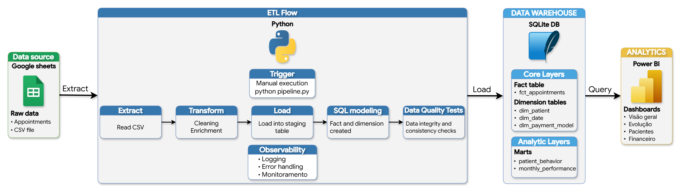
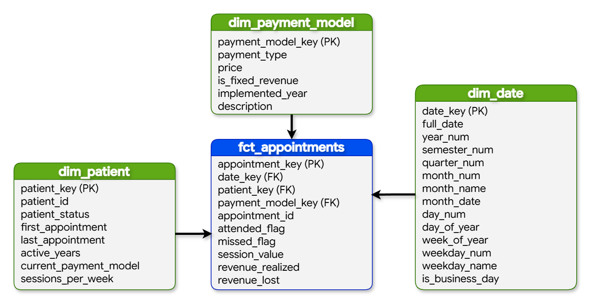

# End-to-End Data Pipeline: Da Assiduidade à Previsibilidade Financeira em Clínica de Terapia Ocupacional Pediátrica  

  
  
  
  
  
  
  
  
  

  

>[!NOTE] 
>Esse projeto foi desenvolvido a partir de dados reais de um consultório de Terapia Ocupacional Pediátrica.  
>Por questões de segurança e privacidade, todos os dados foram **anonimizados**.

## Problema de Negócio

O consultório de Terapia Ocupacional operava com um modelo de atendimento que vinculava diretamente a receita à presença do paciente, com **cobrança realizada por sessão**. Na prática, esse modelo gerava um incentivo indireto ao **absenteísmo:** como não havia custo ao faltar, parte dos pacientes não mantinha a regularidade necessária.

Com o tempo, esse comportamento passou a gerar **dois impactos** críticos:
- **Impacto Terapêutico:** Faltas recorrentes interrompiam a continuidade do tratamento, reduzindo a eficácia das intervenções e prejudicando o desenvolvimento clínico dos pacientes.
- **Impacto Operacional:** O faturamento tornava-se altamente volátil e imprevisível. Horários reservados e não utilizados geravam ociosidade na agenda e dificultavam o planejamento financeiro do consultório.  

Apesar desses efeitos serem percebidos na rotina, **não havia visibilidade sobre a real dimensão do problema**. Os dados de agenda, sessões e faturamento estavam dispersos em planilhas isoladas e controles manuais, o que impossibilitava responder perguntas essenciais, como:
- Qual é a taxa real de faltas por paciente?
- Existem padrões sazonais ou comportamentais de faltas?
- Quanto o absenteísmo impacta financeiramente o faturamento mensal?
- Como a frequência das sessões influencia a estabilidade da receita?  

Dessa forma, surgiu a hipótese de migrar para um **modelo de mensalidade recorrente**, onde as famílias pagariam por um pacote fixo de atendimentos. A expectativa era reduzir o absenteísmo e trazer previsibilidade financeira.

Embora análises exploratórias em Excel dessem **indícios positivos**, era necessário **estruturar os dados de forma robusta e consistente**, permitindo transformar uma percepção operacional em evidência quantitativa, validar a eficácia do modelo recorrente e acompanhar os principais indicadores de forma contínua e confiável.

## Objetivo do Projeto

O objetivo central deste projeto foi **estruturar e centralizar** as informações operacionais e financeiras do consultório, criando uma **infraestrutura de dados** confiável para validar a **transição** do modelo de pagamento por sessão para o modelo de mensalidade recorrente.

Para viabilizar uma análise orientada a dados, foi construído um pipeline end-to-end com foco em:

- **Consolidação de Histórico:** integração de dados de atendimentos e faturamento anteriormente dispersos;
- **Modelagem Dimensional:** implementação de uma arquitetura **Star Schema** para análise de assiduidade e performance;
- **Geração de Evidências:** criação de indicadores consistentes para mensurar o impacto da mudança no absenteísmo e na previsibilidade de receita.

Com isso, o projeto permite transformar uma hipótese operacional em evidência quantitativa, apoiando decisões que aumentam a continuidade do tratamento e previsibilidade financeira.

## Estratégia da Solução

### Visão Analítica

A construção da solução partiu da necessidade de validar uma hipótese observada na prática: a correlação entre o modelo de cobrança por sessão e as taxas de absenteísmo e a estabilidade da receita.

A estratégia foi estruturada na comparação de cenários "antes e depois", permitindo avaliar os efeitos da transição para o modelo de mensalidade a partir de duas perspectivas:

- **Comportamental:** análise dos padrões de assiduidade e frequência real dos pacientes;
- **Financeira:** impacto direto das faltas na receita e na previsibilidade do faturamento futuro.

Para mensurar o sucesso, foram definidos indicadores-chave (KPIs), como:

**- Taxa de Faltas;**  
**- Crescimento da receita;**  
**- Variância de Receita;**  

Essa estrutura analítica permitiu transformar uma percepção operacional em um problema mensurável, auditável e orientado a dados.

### Implementação Técnica

O plano de desenvolvimento focou em transformar registros manuais e descentralizados em uma arquitetura de dados robusta e automatizada, estabelecendo uma Fonte Única de Verdade (SSOT) baseada nos princípios de Analytics Engineering.

A execução foi dividida em quatro pilares:

#### 1. Automação da Ingestão e Limpeza (Python)
Extração e tratamento automatizado dos dados brutos para garantir reprodutibilidade, eliminando inconsistências manuais e duplicidades.

#### 2. Modelagem Dimensional e Governança (SQL/SQLite)
Estruturação em modelo Star Schema para garantir performance em análises complexas.

#### 3. Implementação de Data Quality Gates
Camada de validação com 14 testes que garantem integridade referencial e aderência às regras de negócio antes da disponibilização dos dados, mitigando riscos de decisões baseadas em informações inconsistentes.

#### 4. Dataviz e Storytelling (Power BI)
Construção de um dashboard executivo focado em evidenciar o impacto da transição do modelo de negócio, tanto na saúde financeira da clínica quanto na adesão ao tratamento dos pacientes.

## Tecnologias Utilizadas

|Ferramenta    | Descrição                                                               | 
|--------------|-------------------------------------------------------------------------|
| Python       | Pipeline ETL: ingestão, limpeza, transformação e orquestração dos dados |
| SQL / SQLite | Modelagem dimensional (Star Schema) e consultas analíticas              | 
| Power BI     | Desenvolvimento de dashboards interativos e análise de KPIs             |
| Git / Github | Versionamento de código e controle de mudanças                          |

## Arquitetura e Modelagem

### Arquitetura da Solução

*A solução foi estruturada como um **pipeline de dados end-to-end**, no qual os dados brutos passam por um processo de **ETL em Python**, são modelados em um banco **SQLite** no formato **Star Schema**, validados por **testes de qualidade** e, por fim, consumidos em dashboards no **Power BI**.*

### Modelagem Dimensional (Star Schema)

*O modelo segue uma estrutura **Star Schema**, com tabelas fato representando os atendimentos (fct_appointments) e dimensões como pacientes (dim_patient), calendário (dim_date) e modelo de pagamento (dim_payment_model), garantindo alta performance e flexibilidade analítica.*  
  
*Para otimizar o consumo e suportar análises específicas, foram desenvolvidas **duas data marts especializadas**:*
- **mart_patient_behavior:** análise do comportamento e padrão de faltas dos pacientes.
- **mart_monthly_performance:** análise de faturamento e previsibilidade de receita.

## Principais Insights

A análise foi conduzida por meio de uma abordagem comparativa **antes vs depois** (2022 vs 2023), considerando a transição do modelo de cobrança.

A partir da análise dos dados históricos, foram identificados padrões relevantes no comportamento dos pacientes e no impacto direto do modelo de cobrança sobre a operação:

- A taxa de faltas atingia **25,35%**, indicando baixa adesão ao tratamento e alta ociosidade na agenda  
- Em média, cada paciente faltava aproximadamente **1 sessão por mês**, impactando diretamente a continuidade terapêutica  
- A receita apresentava alta volatilidade (**±311,22**), tornando o fluxo de caixa imprevisível  
- O modelo de pagamento por sessão criava um **incentivo indireto ao absenteísmo**, já que não havia penalização financeira para faltas  

Esses fatores evidenciaram que o problema não era apenas operacional, mas estrutural, estando diretamente ligado ao modelo de cobrança adotado.

## Resultados

A implementação do modelo de mensalidade recorrente gerou melhorias significativas tanto na performance operacional quanto na estabilidade financeira do consultório.

### Indicadores Antes vs Depois

| Indicador                  | Antes (2022) | Depois (2023) | Variação            |
|----------------------------|--------------|---------------|---------------------|
| Taxa de Faltas (%)         | 25,35%       | 12,48%        | -12,87 pp (-50,77%) |
| Receita Total Anual        | R$ 21.350    | R$ 26.400     | +23,65%             |
| Receita Média Mensal       | R$ 1.779,17  | R$ 2.200,00   | +R$ 420,83          |
| Receita Média por Paciente | R$ 1.642,31  | R$ 2.030,77   | +23,65%             |
| Volatilidade da Receita    | ±311,22      | ~0            | Estabilidade        |
| Pacientes Ativos           | 10           | 10            | Estável             |

### Principais Resultados

#### Impacto Operacional e Terapêutico

- **Redução de 50,77% no absenteísmo**: A frequência média de faltas reduziu de aproximadamente **1 ausência mensal para 1 a cada 2 meses**.
- **Mudança comportamental:** O padrão de faltas dos pacientes que migraram para o modelo recorrente tornou-se **consistente com o comportamento dos pacientes já inseridos nesse modelo**, indicando estabilidade no novo padrão de assiduidade.
- **Adesão ao tratamento:** A maior regularidade contribui diretamente para a continuidade e eficácia do tratamento terapêutico.

#### Impacto Financeiro

- **Crescimento de 23,65% na receita total:** Alcançado **sem necessidade de aumentar a base de pacientes**, evidenciando ganho de eficiência operacional.  
- **Estabilização da receita mensal:** Volatilidade da receita reduzida a zero, eliminando o impacto financeiro das faltas.
- **Aumento do ticket médio:** O modelo provou ser mais eficiente, elevando a receita média gerada por paciente.   

#### Dinâmica de Pacientes

- **7 pacientes migraram** para o modelo recorrente  
- **3 novos pacientes** foram adquiridos  
- **3 pacientes saíram (churn)**, mantendo a base de pacientes estável  
- **Capacidade de ocupação permaneceu em 100%**, mantendo o fluxo operacional 

## Conclusão

Os resultados confirmam a hipótese inicial: o modelo de cobrança recorrente não apenas melhora a previsibilidade financeira, como também influencia diretamente no comportamento dos pacientes, reduzindo faltas e aumentando a aderência ao tratamento.

O projeto demonstra como uma mudança estrutural, quando orientada por dados, pode gerar impacto simultâneo em eficiência operacional, qualidade do serviço prestado e estabilidade financeira.